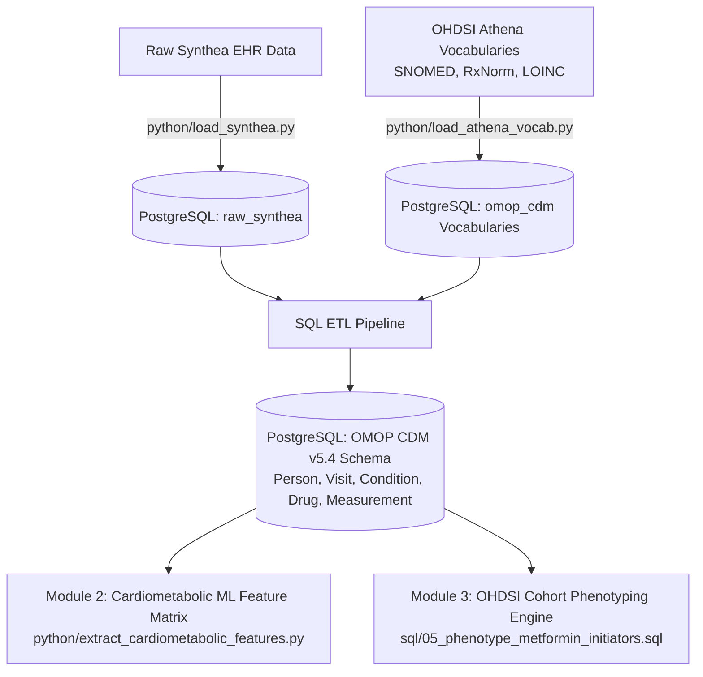

# End-to-End OMOP CDM v5.4 Ecosystem: ETL, ML Feature Engine & OHDSI Phenotyping

An end-to-end Healthcare Data Engineering and Health Informatics repository converting raw synthetic EHR data (**Synthea**) into the standardized **OHDSI OMOP Common Data Model (v5.4)** using **PostgreSQL**, **Python**, and **Athena Vocabularies**. 

Includes downstream applications for **Cardiometabolic Machine Learning Feature Extraction** (aligned with CRIS/SIMFONI Singapore) and **OHDSI Atlas-style Clinical Cohort Phenotyping**.

---

## 🏗 Architecture & System Overview



---

## 📊 Modules & Portfolio Highlights

### Module 1: End-to-End OMOP CDM v5.4 ETL
* **Vocabulary Scale:** Ingested **~25M+ rows** of standardized OHDSI Athena vocabularies (1.9M Concepts, 13M Relationships, 10.9M Ancestors).
* **Clinical Domains Standardized:** `PERSON`, `OBSERVATION_PERIOD`, `VISIT_OCCURRENCE`, `CONDITION_OCCURRENCE`, `DRUG_EXPOSURE`, and `MEASUREMENT`.
* **Terminology Mapping:** Mapped raw clinical values dynamically to **SNOMED CT**, **RxNorm**, and **LOINC**.

### Module 2: Cardiometabolic ML Feature Store (CRIS/SIMFONI Aligned)
* Extracted normalized, tabular patient feature matrices (`cardiometabolic_ml_cohort.csv`) tailored for AI foundation models predicting 3-year diabetic complications (CKD, Hypertension, Hyperlipidemia).
* Captures multi-ethnic demographics, HbA1c lab trajectories, and medication exposure flags.

### Module 3: OHDSI Phenotype & Cohort Definition Engine
* Implemented reproducible OHDSI Atlas-style cohort logic storing cohort definitions in `omop_cdm.cohort_definition` and `omop_cdm.cohort`.
* Evaluated **T2D New Metformin Initiators** (Cohort ID: 101), generating continuous attrition summaries and target cohort metrics.

---

## 📁 Repository Structure

```text
omop-cdm-synthea-etl/
├── .gitignore
├── README.md
├── requirements.txt
├── config.py.template
├── python/
│   ├── load_synthea.py
│   ├── load_athena_vocab.py
│   ├── load_remaining_synthea.py
│   ├── extract_cardiometabolic_features.py
│   └── generate_cohort_report.py
└── sql/
    ├── 01_setup_schemas.sql
    ├── 02_create_omop_tables.sql
    ├── 03_etl_transformations.sql
    ├── 04_data_quality_checks.sql
    └── 05_phenotype_metformin_initiators.sql
```

---

## 🚀 How to Run Locally

### 1. Environment Setup
```bash
git clone [https://github.com/harishedu11-hash/omop-cdm-synthea-etl.git](https://github.com/harishedu11-hash/omop-cdm-synthea-etl.git)
cd omop-cdm-synthea-etl
pip install -r requirements.txt
```

### 2. Execution Order
1. **Schema & Vocabularies:** Run `sql/01_setup_schemas.sql` and `python/load_athena_vocab.py`.
2. **Raw Staging:** Run `python/load_synthea.py` and `python/load_remaining_synthea.py`.
3. **OMOP ETL Transforms:** Execute SQL scripts `02` through `04` in pgAdmin 4.
4. **ML Extraction & Phenotyping:**
   * Run `python/extract_cardiometabolic_features.py` for ML dataset export.
   * Run `sql/05_phenotype_metformin_initiators.sql` and `python/generate_cohort_report.py` for cohort summary.