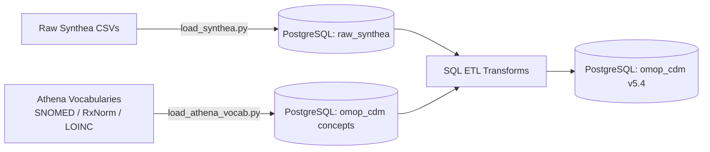

# End-to-End OMOP CDM v5.4 ETL Pipeline

An end-to-end Healthcare Data Engineering pipeline converting raw synthetic EHR data (**Synthea**) into the standardized **OHDSI OMOP Common Data Model (v5.4)** using **PostgreSQL**, **Python**, and **Athena Vocabularies**.

---

## 🏗 Architecture & Data Flow



---

## 📊 Pipeline Highlights

* **Vocabulary Scale:** Bulk-loaded **~25M+ rows** of standard medical vocabularies (1.9M Concepts, 13M Relationships, 10.9M Ancestors) from OHDSI Athena.
* **Clinical Domains Processed:** `PERSON`, `OBSERVATION_PERIOD`, `VISIT_OCCURRENCE`, `CONDITION_OCCURRENCE`.
* **Standard Terminology Mapping:** Dynamic SNOMED CT lookup joins for conditions, and standardized concept mapping for demographics and encounter classes.
* **Performance Tuning:** Implemented primary/foreign key constraints and indexing on key joins (`person_id`, `condition_concept_id`).

---

## 🚀 How to Run Locally

### 1. Prerequisites
* PostgreSQL 15+ & pgAdmin 4
* Python 3.10+
* Downloaded OHDSI Athena Vocabularies (SNOMED, RxNorm, LOINC, ICD10CM)

### 2. Environment Setup
```bash
git clone [https://github.com/YOUR_USERNAME/omop-cdm-synthea-etl.git](https://github.com/YOUR_USERNAME/omop-cdm-synthea-etl.git)
cd omop-cdm-synthea-etl
pip install -r requirements.txt
```

### 3. Database Initialization & ETL
1. Run `sql/01_setup_schemas.sql` in pgAdmin 4.
2. Run raw data staging: `python python/load_synthea.py`
3. Run vocabulary ingestion: `python python/load_athena_vocab.py`
4. Run OMOP CDM table creation and transforms:
   * `sql/02_create_omop_tables.sql`
   * `sql/03_etl_transformations.sql`
   * `sql/04_data_quality_checks.sql`
   * `sql/05_indexes_and_constraints.sql`